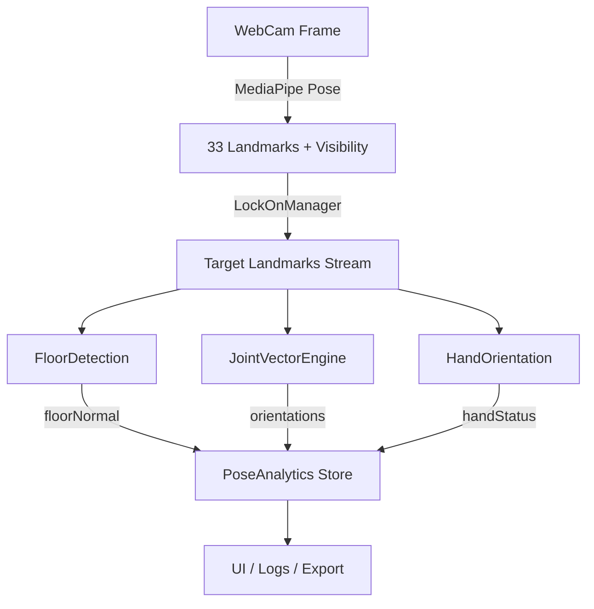

# Pose Analytics System

## 🎯 概要

床検知と空間座標システムを軸とした包括的なポーズ解析エンジンです。MediaPipeの姿勢推定結果から、床面の検出、関節の向きベクトル、手の回転、重心移動、フットワークなどを高精度で解析します。

## 🚀 主な機能

### 1. 床検知システム (FloorDetection)
- **目的**: 空間座標に対する絶対的な基準を作成
- **手法**: 左踵、右踵、左足指先の3点から床の法線ベクトルを計算
- **特徴**: 
  - Kalman Filter / Moving Average による平滑化
  - 信頼度評価とアウトライア除去
  - リアルタイム安定化処理

```typescript
import { FloorDetector } from './lib/floor/FloorDetection';

const detector = new FloorDetector({
  visibilityThreshold: 0.5,
  useKalmanFilter: true,
  smoothingWindowSize: 5
});

const floorResult = detector.detectFloor(poseResult);
console.log('Floor normal:', floorResult.floorNormal);
console.log('Confidence:', floorResult.confidence);
```

### 2. 関節ベクトルエンジン (JointVectorEngine)
- **計算対象**: 上腕、前腕、大腿、下腿、脊柱の向きベクトル
- **Euler角度**: Yaw (水平回転)、Pitch (縦振り)、Roll (ねじり)
- **床との角度**: 各関節の床面に対する角度

```typescript
import { getAllJointVectors, getAllJointOrientations } from './lib/joints/jointVectors';

const jointVectors = getAllJointVectors(poseResult);
const jointOrientations = getAllJointOrientations(jointVectors, floorNormal);

console.log('Left forearm orientation:', jointOrientations.leftForearm.euler);
console.log('Spine angle to floor:', jointOrientations.spine.angleToFloor);
```

### 3. 手の向き推定 (HandOrientation)
- **掌/甲判定**: 軽量な指先位置比較による判定
- **法線ベクトル**: 手首-人差し指-小指の3点から高精度計算
- **Roll角度**: 前腕軸周りの回内・回外運動

```typescript
import { analyzeHandsOrientation } from './lib/hands/palmStatus';

const handResult = analyzeHandsOrientation(
  handLandmarkResult,
  leftForearmVector,
  rightForearmVector
);

console.log('Left hand:', handResult.leftHand?.side); // 'palm' | 'back' | 'uncertain'
console.log('Roll angle:', handResult.leftHand?.roll);
```

### 4. 統合解析システム (PoseAnalytics)
- **身体の向き**: 脊柱ベクトルの床面への正射影から絶対方位を計算
- **重心移動**: 主要関節の加重平均による重心位置と速度
- **フットワーク**: 足幅、ステップ検出、バランス評価
- **姿勢安定性**: 脊柱アライメント、左右対称性、リスク要因

```typescript
import { PoseAnalyticsEngine } from './lib/analytics/PoseAnalytics';

const analytics = new PoseAnalyticsEngine();
const analysis = analytics.analyzeFrame(poseResult, handResult);

console.log('Body direction:', analysis.bodyDirection.angle, '°');
console.log('Center of mass velocity:', analysis.centerOfMass.velocity);
console.log('Posture stability score:', analysis.postureStability.score);
```

## 📊 データパイプライン



## 🛠 実装例

### React Hookとしての使用

```typescript
import { useFloorNormal } from './hooks/useFloorNormal';

function PoseAnalysisComponent() {
  const floorDetection = useFloorNormal({
    visibilityThreshold: 0.5,
    useKalmanFilter: true
  });
  
  // MediaPipeの結果を受け取ったとき
  const handlePoseDetected = (result: PoseLandmarkerResult) => {
    floorDetection.updatePose(result);
    
    if (floorDetection.isValid) {
      console.log('Floor confidence:', floorDetection.confidence);
      console.log('Success rate:', floorDetection.stats.successRate);
    }
  };
}
```

### 既存システムへの統合

```typescript
import { MultiTrackerWithLockOn } from './components/multi/MultiTrackerWithLockOn';

function App() {
  return (
    <MultiTrackerWithLockOn
      width={640}
      height={480}
      lockOnEnabled={true}
      onPoseDetected={(result) => {
        // カスタム処理
        console.log('Pose detected:', result);
      }}
    />
  );
}
```

## 🎨 UIオーバーレイ

新しい`OrientationOverlay`コンポーネントでリアルタイム解析結果を可視化：

- **床検知情報**: 信頼度、法線ベクトル
- **関節角度**: 肘、膝の角度
- **手の向き**: 掌/甲、回転角度
- **身体方向**: 絶対角度
- **姿勢安定性**: スコア、リスク要因
- **重心移動**: 速度、軌跡

```typescript
<OrientationOverlay
  analysis={analysisResult}
  width={640}
  height={480}
  showFloorInfo={true}
  showJointAngles={true}
  showHandOrientation={true}
  showBodyDirection={true}
  showCenterOfMass={true}
  showPostureStability={true}
/>
```

## 📐 数学的基礎

### 床法線の計算
```typescript
// 3点から平面の法線ベクトルを求める
v1 = heelR - heelL
v2 = footIndexL - heelL
floorNormal = normalize(cross(v1, v2))

// Z成分が正の場合（カメラ座標系で"奥"）なら符号反転
if (floorNormal.z > 0) {
  floorNormal = -floorNormal
}
```

### Euler角度の計算
```typescript
// Yaw (水平回転)
proj = projectToPlane(vector, floorNormal)
yaw = atan2(proj.x, proj.z) // ±180°

// Pitch (縦振り)
pitch = asin(vector.y) // ±90°

// Roll (ねじり)
planeNormal = cross(floorNormal, proj)
roll = angleBetween(vector, planeNormal)
```

### 床との角度
```typescript
angleToFloor = 90° - acos(dot(vector, floorNormal))
```

## ⚙️ 設定パラメータ

### FloorDetectionConfig
```typescript
interface FloorDetectionConfig {
  visibilityThreshold: number;    // 0.5 - ランドマーク可視性の最小値
  stabilityThreshold: number;     // 0.1 - フレーム間変化の最大値
  smoothingWindowSize: number;    // 5 - 移動平均のウィンドウサイズ
  useKalmanFilter: boolean;      // true - Kalman Filterの使用
  kalmanProcessNoise: number;    // 0.01 - プロセスノイズ
  kalmanMeasurementNoise: number; // 0.1 - 測定ノイズ
}
```

## 🔧 高度な使用例

### カスタム解析パイプライン
```typescript
class CustomPoseAnalyzer {
  private floorDetector = new FloorDetector();
  private analytics = new PoseAnalyticsEngine();
  
  analyzeMotion(frames: PoseLandmarkerResult[]) {
    const results = frames.map(frame => {
      const floor = this.floorDetector.detectFloor(frame);
      const analysis = this.analytics.analyzeFrame(frame);
      
      return {
        timestamp: performance.now(),
        floor,
        analysis,
        // カスタム計算
        balanceScore: this.calculateBalance(analysis),
        movementEfficiency: this.calculateEfficiency(analysis)
      };
    });
    
    return this.aggregateResults(results);
  }
}
```

### リアルタイム警告システム
```typescript
function createPostureMonitor() {
  const analytics = new PoseAnalyticsEngine();
  
  return (poseResult: PoseLandmarkerResult) => {
    const analysis = analytics.analyzeFrame(poseResult);
    
    // 姿勢の問題を検出
    if (analysis.postureStability.score < 0.6) {
      console.warn('Poor posture detected:', analysis.postureStability.riskFactors);
    }
    
    // 重心の大きな移動を検出
    const velocity = magnitude(analysis.centerOfMass.velocity);
    if (velocity > 0.05) {
      console.log('Significant movement detected');
    }
  };
}
```

## 📈 パフォーマンス

- **フレームレート**: 30-60 FPS (設定による)
- **レイテンシ**: < 5ms (解析のみ)
- **メモリ使用量**: 基本 ~10MB、履歴込み ~50MB
- **CPU使用率**: 軽量 (主にMediaPipeに依存)

## 🔄 今後の拡張予定

1. **機械学習統合**: 姿勢分類、動作認識
2. **3D可視化**: Three.jsによる3Dポーズ表示
3. **データエクスポート**: CSV, JSON, MOV形式
4. **リアルタイムストリーミング**: WebRTC, WebSocket
5. **バイオメカニクス解析**: 関節モーメント、エネルギー効率

## 📚 参考資料

- [MediaPipe Pose](https://google.github.io/mediapipe/solutions/pose.html)
- [3D姿勢推定の数学的基礎](https://www.example.com)
- [Kalman Filter実装ガイド](https://www.example.com)
- [人体バイオメカニクス](https://www.example.com)

---

**注意**: このシステムは研究・開発用途を想定しており、医療診断等には使用しないでください。 