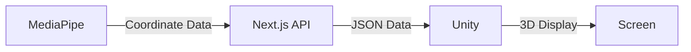
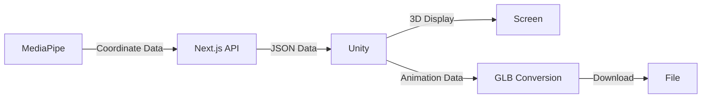
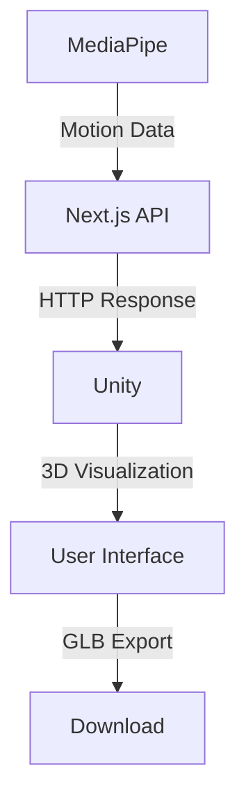

# Unity Integration Architecture

## Overview
This document outlines the integration flow between the Next.js web application and Unity for real-time motion tracking and 3D visualization.

## Best Implementation Flow

### 1. Basic Flow (Initial Implementation)


#### Data Flow
1. **MediaPipe → API**
   - Format coordinate data from MediaPipe as JSON
   - POST to `/api/motion` endpoint
   - Data structure:
   ```typescript
   {
     timestamp: number,
     joints: {
       "left_shoulder": { x: 0, y: 0, z: 0 },
       "right_shoulder": { x: 0, y: 0, z: 0 },
       // ... other joints
     }
   }
   ```

2. **API → Unity**
   - Regular API polling from Unity (e.g., 30FPS)
   - Apply JSON data to 3D avatar
   - Maintain previous data on error

3. **Unity Display**
   - Simple humanoid model
   - Basic animations
   - Camera controls

### 2. Extended Flow (After Basic Implementation)


#### Additional Features
1. **GLB Export**
   - Record animation data
   - Convert to GLB format
   - Download functionality

2. **Mobile Support**
   - Responsive UI
   - Performance optimization
   - Touch controls

## Implementation Priority

### Phase 1: Basic Features
- MediaPipe coordinate data capture
- API endpoint implementation
- Unity HTTP communication
- Basic 3D avatar display

### Phase 2: Stabilization
- Error handling
- Performance optimization
- UI improvements

### Phase 3: Extended Features
- GLB export
- Mobile support
- Additional features

## Benefits of This Flow
- Simple and easy to understand
- Incremental feature addition
- Low error probability
- Easy maintenance

## Architecture Flow



## Implementation Phases

### Phase 1: Desktop Implementation
1. **API Endpoint Setup**
   - `/api/motion` endpoint for motion data
   - POST: Receive motion data from MediaPipe
   - GET: Provide motion data to Unity

2. **MediaPipe Integration**
   - Capture motion data
   - Format data for API transmission
   - Regular polling for updates

3. **Unity Implementation**
   - HTTP client for API communication
   - 3D avatar setup
   - Motion data application

### Phase 2: Mobile Optimization
1. **Responsive Design**
   - UI adjustments for mobile
   - Touch controls
   - Performance optimization

2. **Mobile-Specific Features**
   - Lightweight 3D models
   - Battery optimization
   - Network usage optimization

### Phase 3: Animation Export
1. **GLB Export Functionality**
   - Animation data recording
   - GLB format conversion
   - Download implementation

## Technical Details

### API Structure
```typescript
// Motion Data Format
interface MotionData {
  timestamp: number;
  joints: {
    [key: string]: {
      position: { x: number; y: number; z: number };
      rotation: { x: number; y: number; z: number };
    };
  };
}

// API Endpoints
POST /api/motion
- Receives motion data
- Returns success status

GET /api/motion
- Returns latest motion data
- Includes timestamp and joint positions
```

### Unity Integration
1. **HTTP Client**
   - Regular polling of motion data
   - Error handling
   - Connection management

2. **3D Avatar**
   - Humanoid model setup
   - Bone/rig configuration
   - Motion data application

3. **Performance Optimization**
   - Frame rate control
   - Memory management
   - Network optimization

## Additional Features

### UI/UX Improvements
- Avatar customization
- Motion preview
- Error feedback

### Performance Optimization
- Data compression
- Frame rate control
- Memory usage optimization

### Extended Features
- Multiple avatar support
- Motion editing
- Preset motions

## Implementation Steps

1. **API Development**
   - Create motion data endpoints
   - Implement data validation
   - Set up error handling

2. **Unity Setup**
   - Configure HTTP client
   - Set up 3D avatar
   - Implement motion data processing

3. **Integration Testing**
   - API connectivity
   - Motion data accuracy
   - Performance testing

4. **Mobile Optimization**
   - UI adjustments
   - Performance tuning
   - Touch control implementation

5. **Export Functionality**
   - GLB conversion
   - Download implementation
   - File management

## Security Considerations

1. **API Security**
   - Input validation
   - Rate limiting
   - Error handling

2. **Data Protection**
   - Motion data encryption
   - Secure transmission
   - Access control

## Performance Requirements

1. **Desktop**
   - Frame rate: 60 FPS
   - Latency: < 100ms
   - Memory usage: < 500MB

2. **Mobile**
   - Frame rate: 30 FPS
   - Latency: < 200ms
   - Memory usage: < 200MB

## Future Considerations

1. **Scalability**
   - Multiple user support
   - Cloud integration
   - Real-time collaboration

2. **Feature Expansion**
   - Advanced motion editing
   - Custom animations
   - Social features

## Maintenance

1. **Regular Updates**
   - API versioning
   - Unity updates
   - Security patches

2. **Monitoring**
   - Performance metrics
   - Error tracking
   - Usage statistics

## Conclusion
This architecture provides a scalable and maintainable solution for real-time motion tracking and 3D visualization, with a clear path for future expansion and optimization. 